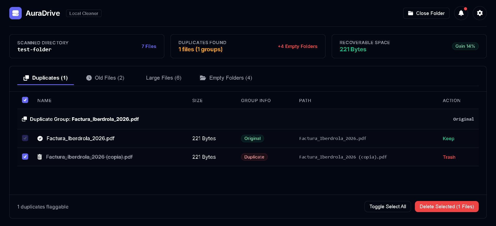

# AuraDrive

> **Reclaim your storage, protect your privacy, and organize with a complete safety net.**

[](https://pabloaballe.github.io/aura-drive/)

---

## ⚡ The Problem: Bloated Drives & Lost Peace of Mind

Our hard drives and synced cloud folders are constantly overflowing with duplicate images, forgotten massive backups, and stale screenshots. 

* **The tedious search**: Spending hours manually hunting down duplicates.
* **The privacy risk**: Uploading your personal directory trees to third-party cloud cleaners.
* **The fear of deletion**: Accidentally deleting a critical file with no easy way to get it back.

---

## 🎯 The Solution: AuraDrive

**AuraDrive** is a minimalist, local-first web dashboard that cleans up your folder chaos in seconds. Built on modern web technologies, it runs **100% inside your browser offline**. Your files never leave your computer.

### 👉 [Launch AuraDrive Web App Live](https://pabloaballe.github.io/aura-drive/)

---

## ✨ Features Built for Speed & Safety

* 🛡️ **Absolute Privacy**: No servers, no accounts, no APIs. Directory scanning and local file movements are performed locally using the native browser File System Access API.
* ↩️ **Safety Net (Interactive Undo)**: Relocate and clean without fear. If you make a mistake, one click on the **Undo** button instantly restores every file back to its original name and path, and cleans up empty folders.
* 🗑️ **Smart Duplicate Cleaner**: Groups identical files (by name proxy and size) and moves copies to a virtual trash folder (`_Trash/`) in a single click.
* 📅 **Stale Files Sorter & Ranking**: Set your preferred age threshold (e.g. 90, 180, or 360 days) to see a list of old files ranked by size (largest first). Select and click **Archive** to move them into an `_Archive/` folder, preserving their original folder structure.

---

## 🛠️ How To Test (Offline Workspace)

We've included a pre-configured [test-folder](./test-folder) in this repository containing mock files so you can test all features safely out of the box:
* **Duplicate Screeners**: Multiple identical images and screenshot copies.
* **Stale Archives**: Large backups and videos modified months ago.

1. Open [AuraDrive Live](https://pabloaballe.github.io/aura-drive/).
2. Select or drag the [test-folder](./test-folder) into the app.
3. Review the preview lists, test the filters/sort rankings, and execute a **Clean** or **Archive**.
4. Click **Undo** to watch everything restore instantly.

---

## 🚀 Running Locally (Developer Quickstart)

AuraDrive is built with **React, TypeScript, and Vite**, matching the clean aesthetic of **Shadcn/UI**.

1. **Clone the repository**:
   ```bash
   git clone https://github.com/PabloAballe/aura-drive.git
   ```
2. **Start the local server**:
   - On **Windows**: Double-click `run.bat` (automatically configures local node paths and launches the dev server).
   - Alternatively (any OS): Run `npm install` and then `npm run dev`.
3. **Open in browser**:
   Navigate to: [http://localhost:5173](http://localhost:5173)

*Note: For the native directory scanning experience, we recommend using Google Chrome, Microsoft Edge, or Opera.*
